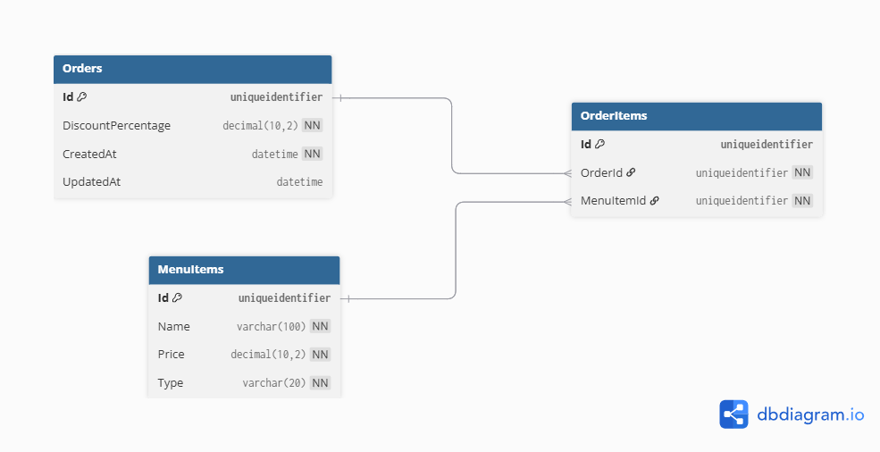
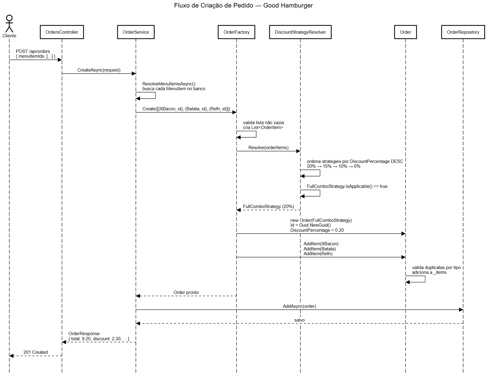

# Good Hamburger API

API REST para gerenciamento de pedidos da lanchonete **Good Hamburger**, desenvolvida em C# com .NET 8, seguindo os princípios de **Clean Architecture**, **Rich Domain Model** e **Design Patterns** (Strategy e Factory).

---

## Sumário

- [Como rodar o projeto](#como-rodar-o-projeto)
- [Arquitetura](#arquitetura)
- [Entidades e diagrama de banco](#entidades-e-diagrama-de-banco)
- [Design Patterns — por que e quais ganhos](#design-patterns--por-que-e-quais-ganhos)
- [Fluxo principal de criação de pedido](#fluxo-principal-de-criação-de-pedido)
- [Tratamento de exceções](#tratamento-de-exceções)
- [Bibliotecas utilizadas](#bibliotecas-utilizadas)
- [Cardápio e IDs para testes](#cardápio-e-ids-para-testes)

---

## Como rodar o projeto

### Pré-requisitos

- [.NET 8 SDK](https://dotnet.microsoft.com/download/dotnet/8.0)
- [SQL Server](https://www.microsoft.com/pt-br/sql-server/sql-server-downloads) (ou SQL Server Express)
- [Node.js](https://nodejs.org/) (para o frontend Angular)
- [Angular CLI](https://angular.io/cli): `npm install -g @angular/cli`

### Backend

**1. Clone o repositório:**
```bash
git clone https://github.com/seu-usuario/good-hamburger.git
cd good-hamburger
```

**2. Configure a connection string em `GoodHamburger.API/appsettings.json`:**
```json
{
  "ConnectionStrings": {
    "DefaultConnection": "Server=localhost;Database=GoodHamburgerDb;Trusted_Connection=True;TrustServerCertificate=True;"
  }
}
```

**3. Aplique as migrations (cria o banco e popula o seed automaticamente):**
```bash
dotnet ef migrations add InitialCreate \
  --project GoodHamburger.Infra.Data \
  --startup-project GoodHamburger.API

dotnet ef database update \
  --project GoodHamburger.Infra.Data \
  --startup-project GoodHamburger.API
```

**4. Rode a API:**
```bash
dotnet run --project GoodHamburger.API
```

**5. Acesse o Swagger:**
```
https://localhost:{porta}/swagger
```

### Frontend

```bash
cd good-hamburger-front
npm install
ng serve
```

Acesse em `http://localhost:4200`.

### Testes

```bash
dotnet test
```

---

## Arquitetura

O projeto segue **Clean Architecture**, dividido em 5 camadas com responsabilidades bem definidas:

```
GoodHamburger.sln
├── src/
│   ├── GoodHamburger.Domain        # Núcleo da aplicação
│   ├── GoodHamburger.Application   # Casos de uso
│   ├── GoodHamburger.Infra.Data    # Persistência
│   ├── GoodHamburger.Infra.IoC     # Injeção de dependências
│   └── GoodHamburger.API           # Entrada HTTP
└── tests/
    └── GoodHamburger.Tests         # Testes unitários
```

### Domain
Núcleo da aplicação — sem dependência de nenhuma outra camada.
- `Entities/` — `Order`, `OrderItem`, `MenuItem` (Rich Domain Model)
- `Strategies/` — `IDiscountStrategy`, `FullComboStrategy`, `SandwichWithDrinkStrategy`, `SandwichWithFriesStrategy`, `NoDiscountStrategy`, `DiscountStrategyResolver`
- `Factory/` — `OrderFactory`
- `Exceptions/` — `DomainException`, `DuplicateItemTypeException`, `OrderNotFoundException`
- `Interfaces/` — `IOrderRepository`, `IMenuItemRepository`
- `Enums/` — `ItemType`

### Application
Orquestra os casos de uso. Depende apenas do Domain.
- `Services/` — `OrderService`, `MenuItemService`
- `DTOs/` — `CreateOrderRequest`, `UpdateOrderRequest`, `OrderResponse`, `MenuItemResponse`, `OrderItemResponse`
- `Interfaces/` — `IOrderService`, `IMenuItemService`
- `Mappings/` — `MappingProfile` (AutoMapper)

### Infra.Data
Implementação da persistência. Depende do Domain.
- `Context/` — `AppDbContext`
- `Repositories/` — `OrderRepository`, `MenuItemRepository`
- `Mappings/` — configurações EF Core (`OrderMapping`, `OrderItemMapping`, `MenuItemMapping`)
- `Seed/` — `MenuItemSeed` (5 itens fixos do cardápio)

### Infra.IoC
Único arquivo — registra todas as dependências no container do .NET.
- `DependencyInjection.cs`

### API
Entrada da aplicação.
- `Controllers/` — `OrdersController`, `MenuController`
- `Middlewares/` — `ExceptionMiddleware`
- `Program.cs` — configuração do pipeline

---

## Entidades e diagrama de banco

### Entidades

**MenuItem** — representa um item do cardápio.

| Coluna | Tipo | Descrição |
|---|---|---|
| Id | `Guid` | Chave primária |
| Name | `string` | Nome do item |
| Price | `decimal` | Preço |
| Type | `string` | Tipo: `Sandwich`, `Fries` ou `Drink` |

**Order** — representa um pedido.

| Coluna | Tipo | Descrição |
|---|---|---|
| Id | `Guid` | Chave primária |
| DiscountPercentage | `decimal` | Percentual de desconto aplicado no momento da criação |
| CreatedAt | `DateTime` | Data de criação |
| UpdatedAt | `DateTime?` | Data da última atualização |

**OrderItem** — tabela de junção entre pedido e item do cardápio.

| Coluna | Tipo | Descrição |
|---|---|---|
| Id | `Guid` | Chave primária |
| OrderId | `Guid` | FK para `Orders` |
| MenuItemId | `Guid` | FK para `MenuItems` |

### Diagrama de banco


**Cardinalidade:**
- `Orders` 1 — N `OrderItems` (um pedido tem vários itens; cascade delete)
- `MenuItems` 1 — N `OrderItems` (um item do cardápio pode aparecer em vários pedidos; restrict delete)

---

## Design Patterns — por que e quais ganhos

### Strategy — regras de desconto

**Por que?** As regras de desconto são variações de um mesmo comportamento: calcular um percentual com base nos itens do pedido. Sem Strategy, o código seria um `if/else` em cascata — difícil de testar, difícil de estender.

```csharp
// Sem Strategy — frágil
if (temSanduiche && temBatata && temRefri) desconto = 0.20m;
else if (temSanduiche && temRefri) desconto = 0.15m;
else if (temSanduiche && temBatata) desconto = 0.10m;
else desconto = 0m;
```

**Com Strategy**, cada regra é uma classe isolada, testável individualmente:

```
IDiscountStrategy
├── FullComboStrategy        → 20%
├── SandwichWithDrinkStrategy → 15%
├── SandwichWithFriesStrategy → 10%
└── NoDiscountStrategy        → 0%
```

**Ganhos reais:**
- Adicionar uma nova regra de desconto = criar uma nova classe, sem tocar nas existentes (Open/Closed Principle)
- Cada strategy é testada isoladamente em segundos
- O `DiscountStrategyResolver` ordena por percentual decrescente e escolhe a primeira aplicável — sem conflito entre regras

### Factory — criação controlada de pedidos

**Por que?** A criação de um `Order` envolve múltiplos passos: montar os itens, resolver a strategy correta e instanciar o objeto. A `OrderFactory` centraliza essa responsabilidade.

**Ganhos reais:**
- Nenhuma outra parte do código sabe como criar um `Order` — só a factory
- A strategy correta é sempre resolvida antes da criação, sem risco de esquecer
- Fácil de testar: mocka a factory e o pedido chega pronto

### Rich Domain Model — entidade com comportamento

**Por que?** Em vez de um `Order` com só getters/setters e um `OrderService` com 200 linhas fazendo tudo, a entidade carrega suas próprias regras.

**Ganhos reais:**
- `AddItem()` valida duplicatas onde faz sentido — na entidade, não no service
- `GetTotal()`, `GetDiscount()`, `GetSubtotal()` são responsabilidade do `Order`, não do mapper
- O domain é testável sem banco, sem HTTP, sem nada externo

---

## Fluxo principal de criação de pedido

### Visão geral

```
POST /api/orders
      ↓
OrdersController
      ↓
OrderService.CreateAsync()
      ↓
OrderFactory.Create()
      ↓
DiscountStrategyResolver.Resolve()
      ↓
Strategy correta escolhida (ex: FullComboStrategy)
      ↓
new Order(strategy) — DiscountPercentage salvo
      ↓
order.AddItem() × N — valida duplicatas
      ↓
OrderRepository.AddAsync() — persiste no banco
      ↓
AutoMapper → OrderResponse
      ↓
201 Created
```



---

## Tratamento de exceções

Todas as exceções de domínio herdam de `DomainException` e são capturadas pelo `ExceptionMiddleware`, que converte para respostas HTTP sem vazar stack trace para o cliente.

| Exceção | HTTP | Quando ocorre |
|---|---|---|
| `DuplicateItemTypeException` | 400 Bad Request | Pedido com dois itens do mesmo tipo |
| `OrderNotFoundException` | 404 Not Found | Pedido não encontrado por ID |
| `DomainException` | 400 Bad Request | Item do cardápio não encontrado, pedido vazio |
| `Exception` (genérica) | 500 Internal Server Error | Erro inesperado |

**Exemplo de resposta de erro:**
```json
{
  "error": "O pedido já contém um item do tipo 'Sandwich'. Cada pedido pode ter apenas um sanduíche, uma batata e um refrigerante."
}
```

O middleware garante que **toda exceção tem uma mensagem clara** — nunca retorna stack trace em produção.

---

## Bibliotecas utilizadas

| Projeto | Biblioteca | Finalidade |
|---|---|---|
| **Application** | `AutoMapper 12.0.1` | Mapeamento entre entidades e DTOs |
| **Application** | `AutoMapper.Extensions.Microsoft.DependencyInjection 12.0.1` | Registro do AutoMapper no DI |
| **Infra.Data** | `Microsoft.EntityFrameworkCore 8.0.0` | ORM principal |
| **Infra.Data** | `Microsoft.EntityFrameworkCore.SqlServer 8.0.0` | Provider SQL Server |
| **Infra.Data** | `Microsoft.EntityFrameworkCore.Tools 8.0.0` | Migrations via CLI |
| **Infra.Data** | `Microsoft.EntityFrameworkCore.Design 8.0.0` | Suporte ao design-time das migrations |
| **Infra.IoC** | `Microsoft.EntityFrameworkCore.SqlServer 8.0.0` | Configuração do DbContext no DI |
| **API** | `Swashbuckle.AspNetCore` | Documentação via Swagger/OpenAPI |
| **API** | `Microsoft.EntityFrameworkCore.Design 8.0.0` | Migrations com startup project na API |
| **Tests** | `xUnit` | Framework de testes unitários |
| **Tests** | `FluentAssertions` | Assertions legíveis e expressivas |

---

## Cardápio e IDs para testes

O cardápio é fixo e populado automaticamente via seed ao rodar as migrations.

| Item | Tipo | Preço | ID |
|---|---|---|---|
| X Burger | Sanduíche | R$ 5,00 | `11111111-0000-0000-0000-000000000001` |
| X Egg | Sanduíche | R$ 4,50 | `11111111-0000-0000-0000-000000000002` |
| X Bacon | Sanduíche | R$ 7,00 | `11111111-0000-0000-0000-000000000003` |
| Batata Frita | Acompanhamento | R$ 2,00 | `22222222-0000-0000-0000-000000000001` |
| Refrigerante | Acompanhamento | R$ 2,50 | `33333333-0000-0000-0000-000000000001` |

### Exemplos de pedidos para testar os descontos

**Combo completo — 20%**
```json
{
  "menuItemIds": [
    "11111111-0000-0000-0000-000000000003",
    "22222222-0000-0000-0000-000000000001",
    "33333333-0000-0000-0000-000000000001"
  ]
}
```

**Sanduíche + refrigerante — 15%**
```json
{
  "menuItemIds": [
    "11111111-0000-0000-0000-000000000001",
    "33333333-0000-0000-0000-000000000001"
  ]
}
```

**Sanduíche + batata — 10%**
```json
{
  "menuItemIds": [
    "11111111-0000-0000-0000-000000000001",
    "22222222-0000-0000-0000-000000000001"
  ]
}
```

**Só sanduíche — sem desconto**
```json
{
  "menuItemIds": [
    "11111111-0000-0000-0000-000000000002"
  ]
}
```

---
 
### Testando os endpoints via Swagger
 
#### GET /api/Menu — listar cardápio
Sem parâmetros. Clique em **Execute** direto.
 
Resposta esperada: lista com os 5 itens do cardápio.
 
---
 
#### GET /api/Orders — listar todos os pedidos
Sem parâmetros. Clique em **Execute** direto.
 
Resposta esperada: lista de pedidos com subtotal, desconto e total calculados.
 
---
 
#### POST /api/Orders — criar pedido
Clique em **Try it out**, cole um dos JSONs abaixo no body e clique em **Execute**.
 
**Exemplo — combo completo (20%):**
```json
{
  "menuItemIds": [
    "11111111-0000-0000-0000-000000000003",
    "22222222-0000-0000-0000-000000000001",
    "33333333-0000-0000-0000-000000000001"
  ]
}
```
Resposta esperada: `201 Created` com `discountPercentage: 0.2`, `discount: 2.3`, `total: 9.2`.
 
**Exemplo — erro de item duplicado:**
```json
{
  "menuItemIds": [
    "11111111-0000-0000-0000-000000000001",
    "11111111-0000-0000-0000-000000000003"
  ]
}
```
Resposta esperada: `400 Bad Request` com mensagem clara sobre item duplicado.
 
---
 
#### GET /api/Orders/{id} — buscar pedido por ID
1. Rode o `GET /api/Orders` primeiro e copie um `id` da resposta
2. Cole o `id` no campo `id` do `GET /api/Orders/{id}`
3. Clique em **Execute**
Resposta esperada: `200 OK` com os dados do pedido.
 
**Exemplo de ID inválido para testar o 404:**
```
00000000-0000-0000-0000-000000000000
```
Resposta esperada: `404 Not Found` com mensagem de pedido não encontrado.
 
---
 
#### PUT /api/Orders/{id} — atualizar pedido
1. Rode o `GET /api/Orders` e copie um `id`
2. Cole o `id` no campo `id`
3. Cole o JSON abaixo no body (altera para só sanduíche, removendo o desconto)
```json
{
  "menuItemIds": [
    "11111111-0000-0000-0000-000000000001"
  ]
}
```
Resposta esperada: `200 OK` com `discountPercentage: 0`, `discount: 0`, `total: 5.0`.
 
**Outro exemplo — atualiza para sanduíche + refrigerante (15%):**
```json
{
  "menuItemIds": [
    "11111111-0000-0000-0000-000000000002",
    "33333333-0000-0000-0000-000000000001"
  ]
}
```
Resposta esperada: `200 OK` com `discountPercentage: 0.15`, `total: 5.95`.
 
---
 
#### DELETE /api/Orders/{id} — excluir pedido
1. Rode o `GET /api/Orders` e copie um `id`
2. Cole o `id` no campo `id`
3. Clique em **Execute**
Resposta esperada: `204 No Content`.
 
**Exemplo de ID inexistente para testar o 404:**
```
00000000-0000-0000-0000-000000000000
```
Resposta esperada: `404 Not Found`.

### Testando validações e erros via Swagger
 
Todos os erros retornam JSON com a chave `error` e uma mensagem clara — sem stack trace exposto.
 
#### 1. Item duplicado no pedido — `400 Bad Request`
 
Tente criar um pedido com dois sanduíches:
 
`POST /api/Orders`
```json
{
  "menuItemIds": [
    "11111111-0000-0000-0000-000000000001",
    "11111111-0000-0000-0000-000000000003"
  ]
}
```
 
Resposta esperada:
```json
{
  "error": "O pedido já contém um item do tipo 'Sandwich'. Cada pedido pode ter apenas um sanduíche, uma batata e um refrigerante."
}
```
 
Funciona da mesma forma para duplicatas de batata e refrigerante.
 
---
 
#### 2. Pedido vazio — `400 Bad Request`
 
Tente criar um pedido sem nenhum item:
 
`POST /api/Orders`
```json
{
  "menuItemIds": []
}
```
 
Resposta esperada:
```json
{
  "error": "O pedido deve conter pelo menos um item."
}
```
 
---
 
#### 3. Item do cardápio inexistente — `400 Bad Request`
 
Tente criar um pedido com um ID que não existe no cardápio:
 
`POST /api/Orders`
```json
{
  "menuItemIds": [
    "00000000-0000-0000-0000-000000000000"
  ]
}
```
 
Resposta esperada:
```json
{
  "error": "Item do cardápio com ID '00000000-0000-0000-0000-000000000000' não encontrado."
}
```
 
---
 
#### 4. Pedido não encontrado — `404 Not Found`
 
Tente buscar, atualizar ou excluir um pedido com ID inexistente.
 
`GET /api/Orders/00000000-0000-0000-0000-000000000000`
 
Resposta esperada:
```json
{
  "error": "Pedido com ID '00000000-0000-0000-0000-000000000000' não encontrado."
}
```
 
O mesmo erro ocorre no `PUT` e no `DELETE` com ID inexistente.